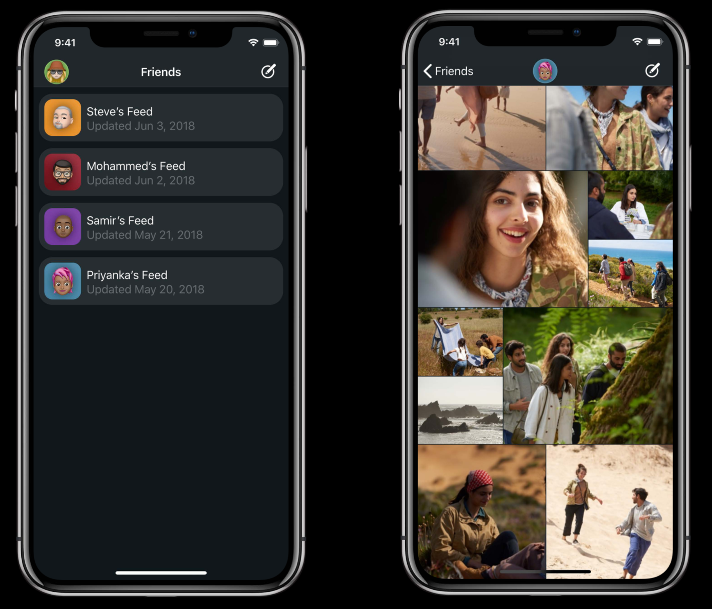

# WWDC 2018 ：CollectionView 之旅

> 本文是 WWDC 2018 Session 225 读后感，其视频及配套 PDF文稿 地址如下 [A Tour Of UICollectionView](https://link.juejin.im/?target=https%3A%2F%2Fdeveloper.apple.com%2Fvideos%2Fplay%2Fwwdc2018%2F225%2F)。
>
> 这篇文章难度不大，由易到难，逐层深入，是一篇很好的 Session。全文总计约2500字，通读全文花费时间大约15分钟。

看完这篇 Session，给我的直观感受是这篇名为 A Tour Of UICollectionView 的文章，是围绕着一个 CollectionView 的案例，对自定义布局以及其性能优化、数据操作、动画做的一次探讨。虽然没有新增的 API 和特性，但是实际意义蛮大。

我们也按照 Session 的思路，将本文主要分为三个模块：

- CollectionView 概述
- 布局（自定义 Layout）
- 数据的刷新、动画

CollectionView 想必各位已经不陌生了，在我们的日常开发中，它的身影随处可见。如果还有小伙伴对它不熟悉，可以看看之前的 Session ：

- WWDC 2016 - [What`s New In CollectionView In iOS 10](https://link.juejin.im/?target=https%3A%2F%2Fdeveloper.apple.com%2Fvideos%2Fplay%2Fwwdc2016%2F219%2F) 。
- WWDC 2017 - [Drag and Drop with Collection and Table View](https://link.juejin.im/?target=https%3A%2F%2Fdeveloper.apple.com%2Fvideos%2Fplay%2Fwwdc2017%2F223%2F)。

如果我们想搭建一个如下图的 App ，需要涉及到三点：布局、刷新、动画，我们今天的话题也是围绕着这三点展开。



## CollectionView 概述

> **CollectionView** 的核心概念有三点：布局（Layout）、数据源（Data Source）、代理（Delegate）。

### UICollectionViewLayout

UICollectionViewLayout 负责管理 UICollectionViewLayoutAttributes，一个 UICollectionViewLayoutAttributes 对象管理着一个 CollectionView 中一个 Item 的布局相关属性。包括 Bounds、center、frame 等。同时要注意在当 Bounds 在改变时是否需要刷新 Layout, 以及布局时的动画。

#### UICollectionViewFlowLayout

UICollectionViewFlowLayout 是 UICollectionViewLayout 的子类,是系统提供给我们一个封装好的流式布局的类。

###### 横向流式布局（白色线代表布局方向）


###### 纵向流式布局（白色线代表布局方向）


这种流式布局需要区分方向，方向不同，具体的 Line Spacing 和 Item Spacing 所代表的含义不同，具体差异，可以通过上面的两张图进行区分。

因为流式布局其强大的适用性，所以在设计中这种布局方式被广泛使用。

### UICollectionViewDataSource

数据源：顾名思义，提供数据的分组信息、每组中 Item 数量以及每个 `Item` 的实际内容。

```
optional func numberOfSections(in collectionView: UICollectionView) -> Int

func collectionView(_ collectionView: UICollectionView, numberOfItemsInSection section: Int) -> Int

func collectionView(_ collectionView: UICollectionView, cellForItemAt indexPath: IndexPath) -> UICollectionViewCell
复制代码
```

### UICollectionViewDelegate

delegate 提供了一些细颗粒度的方法：

- Highlighting
- Selection

还有一些视图的显示事件：

- willDisplayItem
- didEndDisplayingItem

## 布局 - 自定义 Layout

系统提供的 `UICollectionViewFlowLayout` 虽然使用起来方便快捷，能够满足基本的布局需要。但是遇到如下图的布局样式，显然就无法达到我们所需的效果，这时就需要自定义 `FlowLayout`了。


自定义 `FlowLayout` 并不复杂 ，有以下四步：

##### 1.提供滚动范围

```
override var collectionViewContentSize: CGSize 
复制代码
```

##### 2.提供布局属性对象

```
func layoutAttributesForElements(in rect: CGRect) -> [UICollectionViewLayoutAttributes]? 

func layoutAttributesForItem(at indexPath: IndexPath) -> UICollectionViewLayoutAttributes?
复制代码
```

##### 3.布局的相关准备工作

```
// 为每个 invalidateLayout 调用
// 缓存 UICollectionViewLayoutAttributes
// 计算 collectionViewContentSize
func prepare()
复制代码
```

##### 4.处理自定义布局中的边界更改

```
// 在 CollectionView 滚动时是否允许刷新布局
func shouldInvalidateLayout(forBoundsChange newBounds: CGRect) -> Bool
复制代码
```

#### 性能优化部分

通过以上的方法，我们可以轻松实现自定义 `layout` 的布局。但是在实际开发中，有一个对性能提升很实用的小技巧很值得我们借鉴。

通常，我们获取当前屏幕上所有显示的 `UICollectionViewLayoutAttributes` 会这么写

```
override func layoutAttributesForElements(in rect: CGRect) -> [UICollectionViewLayoutAttributes]? {
    return cachedAttributes.filter { (attributes:UICollectionViewLayoutAttributes) -> Bool in
        return rect.intersects(attributes.frame)
    }
}
复制代码
```

采用以上的写法，我们会遍历缓存了所有 UICollectionViewLayoutAttributes 的 cachedAttributes 数组。而随着用户的拖动屏幕，这个方法会被频繁的调用，也就是会做大量的计算。当 cachedAttributes 数组的量级达到一定的规模，对性能的负面影响就会非常明显，用户在使用过程中会出现卡顿的负面体验。

苹果工程师采用的办法可以很好地解决这一问题。所有的 UICollectionViewLayoutAttributes 都按照顺序被存储在 cachedAttributes 数组中，既然是一个有序的数组，那么只要我们通过二分查找，拿到任何一个在当前页面显示的 Attribures 对象，就可以以这个 Attribures 对象为中心，向前向后遍历查找符合条件的 Attribures 对象即可，这样查找的范围就被大大缩小了。相应地，计算量变小，对性能的提升非常明显。


为了让大家易于理解，画了一张图，虽然有点丑，但表达思想足够了。 当前显示的 CollectionView 的范围就是 rect。在 rect 内部通过二分查找，找到第一个合适的 UICollectionViewLayoutAttributes 作为 firstMatchIndex，也就是那个 Attributes 对象。

在 rect 内， firstMatchIndex 以上的 Attributes 都符合 `attributes.frame.maxY >= rect.minY`，而在 firstMatchIndex 以下的 Attributes 也都符合 `attributes.frame.maxY <= rect.maxY` 的条件。

##### 优化后的代码如下

```
override func layoutAttributesForElements(in rect: CGRect) -> [UICollectionViewLayoutAttributes]? {
    
    var attributesArray = [UICollectionViewLayoutAttributes]()
    
    // 找到在当前区域内的任何一个 Attributes 的 Index
    guard let firstMatchIndex = binarySearchAttributes(range: 0...cachedAttributes.endIndex, rect:rect) else { return attributesArray }
    
    // 从后向前反向遍历，缩小查找范围
    for attributes in cachedAttributes[..<firstMatchIndex].reversed {
        guard attributes.frame.maxY >= rect.minY  else {break}
        attributesArray.append(attributes)
    }
    // 从前向后正向遍历，缩小查找范围
    for attributes in cachedAttributes[firstMatchIndex...] {
        guard attributes.frame.minY <= rect.maxY  else {break}
        attributesArray.append(attributes)
    }
    
    return attributesArray
}
复制代码
```

通过二分查找的方式，在处理当前页面显示的 `UICollectionViewLayoutAttributes` 的过程中可以减少遍历的数据量，在实际体验中页面滑动更加顺滑，体验更好，这种处理 `Attribures` 对象的方式，值得我们在开发过程中借鉴。

## 数据刷新和动画

我们会遇到对 `CollectionView` 进行编辑的场景，编辑操作一般是新增、删除、刷新、插入等。在本 Session 中，主讲人为我们做了一个示例。


- 对最后一条数据进行刷新操作
- 将原本在最后位置的数据移动到第一条的位置
- 删除原本的第三条数据

为了便于理解，还是贴一下代码吧：

```
// 原函数
func performUpdates() {
    people[3].isUpdated = true
    
    let movedPerson = people[3]
    people.remove(at:3)
    people.remove(at:2)
    
    people.insert(movedPerson, at:0)
    
    // Update Collection View
    collectionView.reloadItems(at: [IndexPath(item:3, section:0)])
    collectionView.reloadItems(at: [IndexPath(item:2, section:0)])
    collectionView.moveItem(at: IndexPath(item:3, section:0), to:IndexPath(item:0, section:0))
}
复制代码
```

这个例子在操作过程中报错，原因如下：我们删除和移动的是同一个索引位置的元素。我们显示地调用了 `reloadData()` , `reloadData()` 是一个异步执行的函数，会直接访问数据源方法，进行重新布局，多次调用容易出错，同时这样写也没有动画效果。


#### performBatchUpdates

上面出错的场景其实挺常见，为了规范操作，避免在编辑的场景下出现问题，应当将对 `CollectionView` 的新增、删除、刷新、插入等操作都放入到 `performBatchUpdates()` 中的 `updates` 闭包内，`CollectionView` 中 Item 的更新顺序我们不需要关心，但是数据源更新的顺序是很重要的。

首先认识一下这个方法

```
func performBatchUpdates(_ updates: (() -> Void)?, completion: ((Bool) -> Void)? = nil)

1.其中 updates 闭包内部会执行新增、删除、刷新、插入等一系列操作。

2.而 completion 闭包会在 updates 闭包执行完毕后开始执行，updates 闭包中的相关操作会触发一些动画，
  当这些动画执行成功会返回 True，当动画被打断或者执行失败会返回 false，这个参数也有可能会返回 nil。
复制代码
```

这个方法可以用来对 `collectionView` 中的元素进行批量的新增、删除、刷新、插入等操作，同时将触发`collectionView` 的 `layout` 的对应动画:

```
1.func initialLayoutAttributesForAppearingItem(at itemIndexPath: IndexPath) -> NSCollectionViewLayoutAttributes?

2.func initialLayoutAttributesForAppearingDecorationElement(ofKind elementKind: NSCollectionView.DecorationElementKind, at decorationIndexPath: IndexPath) -> NSCollectionViewLayoutAttributes?

3.func finalLayoutAttributesForDisappearingItem(at itemIndexPath: IndexPath) -> NSCollectionViewLayoutAttributes?

4.func finalLayoutAttributesForDisappearingDecorationElement(ofKind elementKind: String, at decorationIndexPath: IndexPath) -> UICollectionViewLayoutAttributes?
复制代码
```

原因是因为在执行完 `performBatchUpdates` 操作之后，CollectionView 会自动 `reloadData` 调用数据源方法重新布局。所以我们在 Updates 闭包中对数据的编辑操作执行完毕后，一定要同步更新数据源，否则有极大的几率出现数据越界等错误情况。

#### 易出错的合并更新一般有以下几种

- 1.移动与删除同一个索引
- 2.移动与插入同一个索引
- 3.将多个对象移动到同一个索引
- 4.引用了一个无效的索引

既然在执行操作时容易出现问题，我们就该想办法去规避，苹果的工程师给出了很好的建议。在上面我们讲过对 `CollectionView` 的新增、删除、刷新、插入等操作都放入到 `performBatchUpdates()` 中的 `updates` 闭包内，`CollectionView` 中 Item 的更新顺序我们不需要关心，但是数据源更新的顺序很重要。最后的 Item 更新顺序和数据源的更新顺序是怎么回事呢？

你可以这样理解：

- 在 Updates 闭包内，你可以选择先删除一个索引，然后插入一个新的索引，或是把两者的顺序颠倒过来进行操作，这都没有问题，你可以按照自己的喜好，随意指定顺序。
- 但是涉及到数据源更新的方法，必须按照一定的顺序和规则来操作。

#### 数据源执行操作的顺序及规则

- 1.将移动操作拆分成删除和插入。
- 2.将所有的删除操作合并到一起，同理将所有的插入操作也合并到一起。
- 3.以降序优先处理删除操作。
- 4.最后以升序处理插入操作。


然后我们将刚才出错的代码，改为如下：

```
// 新的实现
func performUpdates() {
    
    UIView.performWithoutAnimation {
        // 先将数据刷新
        collectionView.performBatchUpdates({
            people[3].isUpdate = true
            collectionView.reloadItems(at: [IndexPath(item:3, section:0)])
        })
    }
        
    // 再将移动拆分成删除之后再插入两个动作
    collectionView.performBatchUpdates({
        let movedPerson = people[3]
        people.remove(at: 3)
        people.remove(at: 2)
        people.insert(movedPerson, at:0)
        CollectionView.deleteItems(at: [IndexPath(item:2, section:0)])
        collectionView.moveItem(at: IndexPath(item:3, section:0), to:IndexPath(item:0, section:0))
    })
}
复制代码
```

最后总结一下，苹果的工程师建议我们通过自定义布局来实现精美的布局样式，同时采取二分查找的方式来高效的处理数据，提升界面的流畅性和用户体验。

其次对 CollectionView 的操作建议我们通过 `performBatchUpdates` 来进行处理，我们不需要去考虑动画的执行，因为默认都帮助我们处理好了，我们只需要注意数据源处理的原则和顺序，确保数据处理的安全与稳定。
