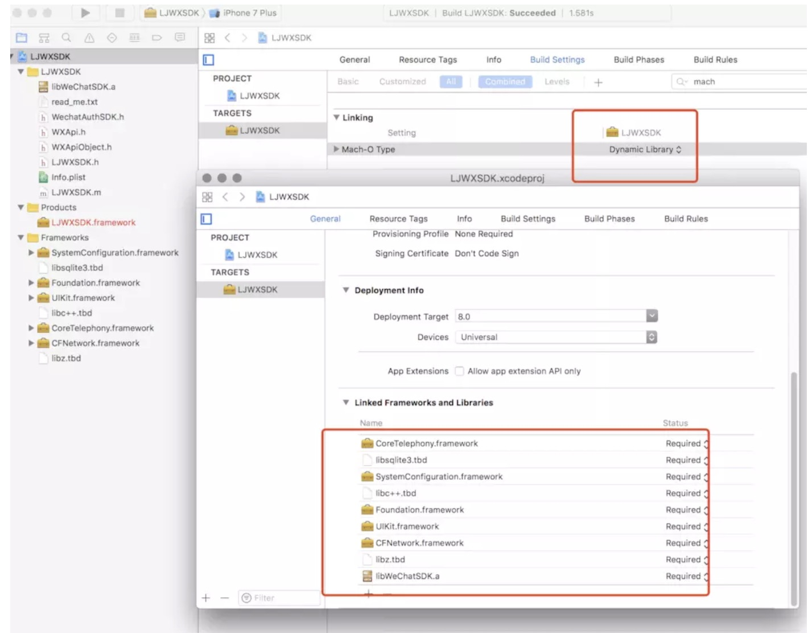
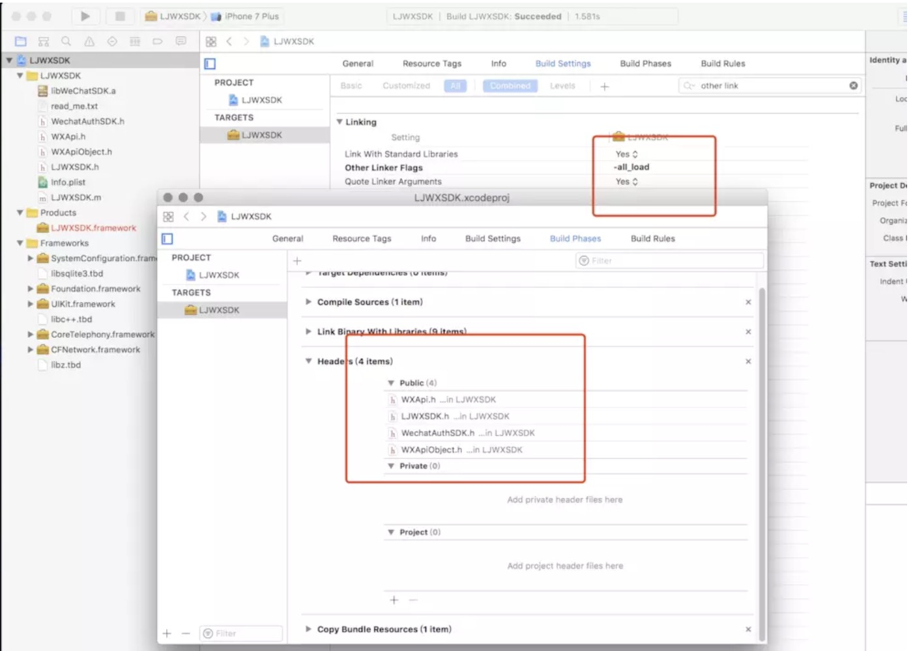

# [制作动态库](https://www.jianshu.com/p/7f6a7e1b3235)

1. 创建动态库项目这里以wx举例

2. 按照微信的官方文档。添加依赖库

3. 将wx的PublicHeader暴露出来，注意由于我并没有使用到wx相关API所以链接器帮我们链接动态库 的时候可能并不会把wx静态库吸附进来。我们手动在build Setting的other link flags加上-all_load标记

4. 在Schema里面跳转编译配置为Release ，并且选择所有的CPU架构

5. 然后选择模拟器或者Generic iOS Device运行编译就会生成对应版本的Framework了。
6. 但是为了保证开发者使用的时候是真机模拟器都能正常使用，我们需要合并不同架构 这里在Build Phases里添加以下脚本，真机和模拟器都Build一遍之后就会在工程目录下生成Products文件夹，

```bash
if [ "${ACTION}" = "build" ]
then
INSTALL_DIR=${SRCROOT}/Products/${PROJECT_NAME}.framework
DEVICE_DIR=${BUILD_ROOT}/${CONFIGURATION}-iphoneos/${PROJECT_NAME}.framework
SIMULATOR_DIR=${BUILD_ROOT}/${CONFIGURATION}-iphonesimulator/${PROJECT_NAME}.framework
if [ -d "${INSTALL_DIR}" ]
then
rm -rf "${INSTALL_DIR}"
fi
mkdir -p "${INSTALL_DIR}"
cp -R "${DEVICE_DIR}/" "${INSTALL_DIR}/"
#ditto "${DEVICE_DIR}/Headers" "${INSTALL_DIR}/Headers"
lipo -create "${DEVICE_DIR}/${PROJECT_NAME}" "${SIMULATOR_DIR}/${PROJECT_NAME}" -output "${INSTALL_DIR}/${PROJECT_NAME}"
open "${DEVICE_DIR}"
open "${SRCROOT}/Products"
fi
```
